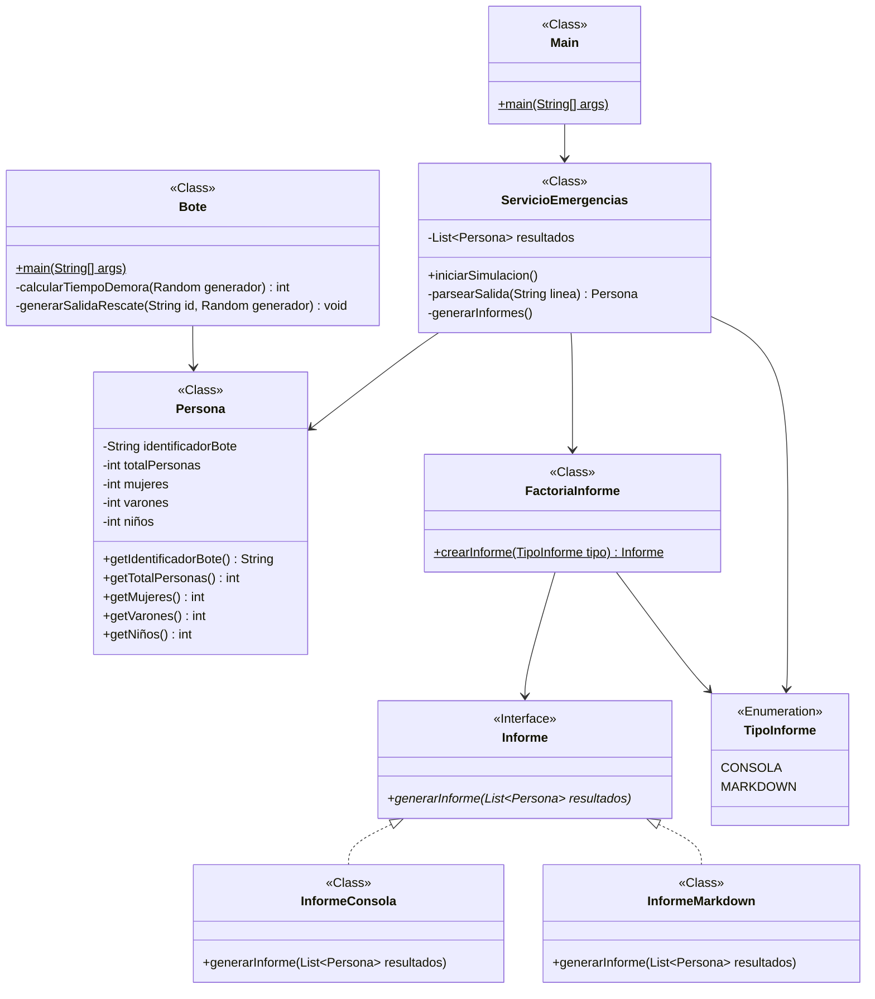
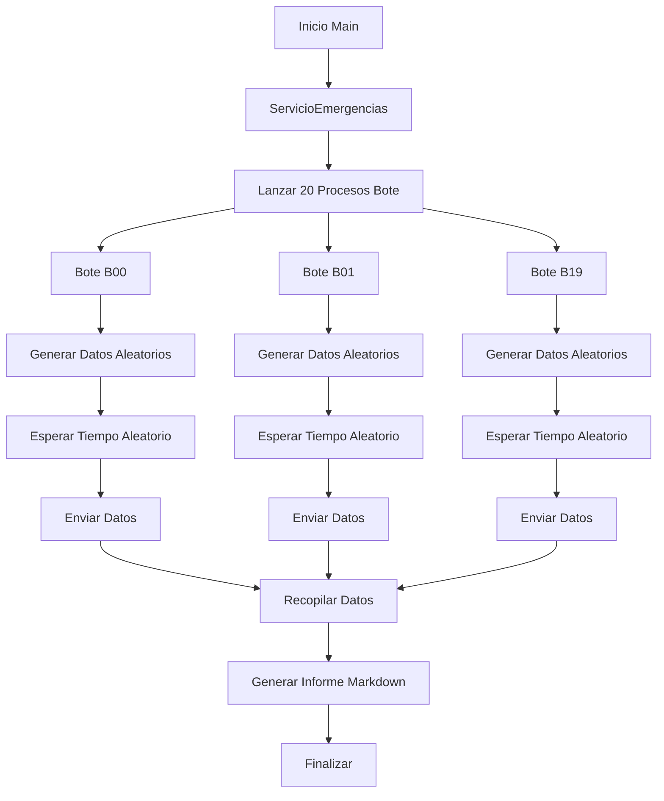

# Rescate Titanic en 1912

## Índice
- [Rescate Titanic en 1912](#rescate-titanic-en-1912)
    - [Indice](#índice)
    - [Integrantes del Proyecto](#integrantes-del-proyecto)
    - [Manual de Usuario](#manual-de-usuario)
    - [Análisis del Problema](#análisis-del-problema)
        - [Requisitos Funcionales](#requisitos-funcionales)
        - [Requisitos No Funcionales](#requisitos-no-funcionales)
    - [Diseño de la Solución](#diseño-de-la-solución)
        - [Paradigma de Desarrollo](#paradigma-de-desarrollo)
        - [Diagramas de Clases](#diagramas-de-clases)
    - [Arquitectura](#arquitectura)
        - [Diagrama de Flujo](#diagrama-de-flujo)
    - [Componentes](#componentes)
    - [Protocolo de Comunicación](#protocolo-de-comunicación)
        - [Formato de Mensajes](#formato-de-mensajes)
    - [Plan de Pruebas](#plan-de-pruebas)
        - [Pruebas Unitarias](#pruebas-unitarias)
        - [Pruebas de Integración](#pruebas-de-integración)
        - [Pruebas de Funcionamiento](#pruebas-de-funcionamiento)
    - [Elementos Destacables del Desarrollo](#elementos-destacables-del-desarrollo)
    - [Problemas Encontrados](#problemas-encontrados)
    - [Conclusiones Individuales](#conclusiones-individuales)

## Integrantes del Proyecto
- Integrante 1: 
- Integrante 2: 

## Manual de Usuario
- Para ejecutar: **mvn exec:java**
- Para ejecutar pruebas: **mvn test**

## Análisis del Problema

El proyecto consiste en simular la gestión de los 20 botes salvavidas del RMS Titanic durante su hundimiento en abril de 1912. El objetivo es implementar un sistema que simule el proceso de rescate desde el lanzamiento de los botes hasta la recopilación y generación de informes finales.

### Requisitos Funcionales
- Simular 20 botes salvavidas con identificadores del B00 al B19
- Generar un número aleatorio de personas por bote (entre 1 y 100)
- Simular un tiempo de espera aleatorio de 2 a 6 segundos por bote para contar a los pasajeros
- Clasificar las personas en categorías: mujeres, varones y niños
- Recopilar la información de todos los botes en un Servicio de Emergencias central
- Generar un informe en formato Markdown con los resultados del rescate

### Requisitos No Funcionales
- Uso de procesos independientes para simular la autonomía de cada bote
- Generación de datos aleatorios realistas para el número de personas por categoría
- Manejo adecuado de tiempos de espera y sincronización entre procesos
- Formato preciso del informe según las especificaciones dadas
- Posibilidad de extensión a otros formatos de informe en el futuro

## Diseño de la Solución

### Paradigma de Desarrollo
Se ha adoptado un enfoque basado en procesos, donde cada bote salvavidas funciona como un proceso independiente que genera sus propios datos y luego se comunica con un proceso central (Servicio de Emergencias). Se utiliza el patrón de diseño Factory para la generación de informes, permitiendo una fácil extensión a diferentes formatos en el futuro.

### Diagramas de Clases


El diagrama de clases muestra la estructura principal del proyecto, incluyendo:
- **Main**: Clase de entrada que inicia la aplicación
- **ServicioEmergencias**: Clase principal que coordina la simulación y genera informes
- **Bote**: Clase que simula el comportamiento de un bote salvavidas
- **Persona**: Clase que almacena los datos de un bote (identificador y recuento de personas)
- **Subsistema de Informes**: Componentes para generar informes en diferentes formatos

## Arquitectura

La arquitectura del sistema sigue un modelo jerárquico basado en procesos, donde:

1. **Proceso Principal (Servicio de Emergencias)**: Se encarga de coordinar la simulación, lanzar los procesos de los botes, recopilar sus datos y generar el informe final.

2. **Procesos Secundarios (Botes)**: Son procesos independientes que simulan el comportamiento de cada bote salvavidas, generando datos aleatorios y comunicándolos al proceso principal.

3. **Comunicación**: Se establece mediante la salida estándar de los procesos secundarios, que es capturada por el proceso principal.

4. **Generación de Informes**: Utiliza el patrón Factory para crear diferentes tipos de informes según sea necesario.

### Diagrama de Flujo



## Componentes

### 1. ServicioEmergencias
- **Responsabilidad**: Coordinar la simulación, lanzar los procesos de los botes, recopilar datos y generar informes
- **Funcionalidades**: 
  - Crear y ejecutar 20 procesos de botes
  - Capturar y parsear la salida de los procesos
  - Almacenar los datos en objetos Persona
  - Generar informes en diferentes formatos
  - Escribir el informe Markdown a un archivo

### 2. Bote
- **Responsabilidad**: Simular el comportamiento de un bote salvavidas de forma autónoma
- **Funcionalidades**:
  - Generar un número aleatorio de personas (1-100)
  - Distribuir aleatoriamente entre mujeres, varones y niños
  - Calcular un tiempo de espera aleatorio (2-6 segundos)
  - Emitir la salida formateada con los datos generados

### 3. Persona
- **Responsabilidad**: Almacenar los datos de un bote salvavidas
- **Atributos**:
  - Identificador del bote
  - Total de personas
  - Cantidad de mujeres
  - Cantidad de varones
  - Cantidad de niños
- **Métodos**: Getters para acceder a los datos

### 4. Subsistema de Informes
- **FactoriaInforme**: Crea instancias de informes según el tipo solicitado
- **Informe (Interfaz)**: Define el método común para generar informes
- **InformeConsola**: Implementa la generación de informes en la consola
- **InformeMarkdown**: Implementa la generación de informes en formato Markdown
- **TipoInforme**: Enumera los tipos de informes disponibles

## Protocolo de Comunicación

La comunicación entre el ServicioEmergencias y los procesos Bote se basa en la salida estándar de los procesos. El protocolo sigue estos pasos:

1. **Lanzamiento**: El ServicioEmergencias lanza 20 procesos Bote, pasando como argumento el identificador de cada bote (B00 a B19)

2. **Generación de Datos**: Cada proceso Bote genera datos aleatorios y espera un tiempo aleatorio

3. **Envío de Datos**: Cada proceso Bote imprime en la salida estándar una cadena formateada con los datos generados (identificador, total, mujeres, varones, niños)

4. **Recopilación**: El ServicioEmergencias captura la salida de cada proceso y la parsea para crear objetos Persona

5. **Generación de Informe**: Una vez recopilados todos los datos, el ServicioEmergencias genera el informe final

### Formato de Mensajes
El formato de salida estándar de cada proceso Bote sigue el patrón:
```
BXX;Total;Mujeres;Varones;Niños
```
Donde:
- BXX: Identificador del bote (ej: B00)
- Total: Número total de personas
- Mujeres: Número de mujeres
- Varones: Número de varones
- Niños: Número de niños

## Plan de Pruebas

### Pruebas Unitarias
- **Bote**: Verificar que genera números aleatorios dentro del rango correcto (1-100 personas)
- **Bote**: Confirmar que el tiempo de espera está entre 2 y 6 segundos
- **Bote**: Validar que la suma de mujeres, varones y niños coincide con el total
- **ServicioEmergencias**: Probar que parsea correctamente la salida de los procesos
- **InformeMarkdown**: Verificar que genera el formato correcto del informe

### Pruebas de Integración
- Probar la comunicación entre ServicioEmergencias y múltiples procesos Bote
- Verificar que se capturan todos los datos correctamente
- Confirmar que el informe final contiene todos los botes y los totales correctos

### Pruebas de Funcionamiento
- Ejecutar la simulación completa con 20 botes
- Verificar que se genera el archivo Informe.md con el formato correcto
- Validar que los tiempos de espera no interfieren con la correcta ejecución

## Elementos Destacables del Desarrollo

1. **Uso de Procesos Independientes**: La implementación utiliza procesos separados para simular la autonomía de los botes, lo que refleja mejor la realidad del escenario de emergencia.

2. **Patrón de Diseño Factory**: Se aplica para la generación de informes, permitiendo una fácil extensión a otros formatos en el futuro sin modificar el código existente.

3. **Generación de Datos Aleatorios**: Se implementan algoritmos para generar datos realistas, incluyendo la distribución de pasajeros por género y edad.

4. **Sincronización de Procesos**: Se gestiona adecuadamente la sincronización entre múltiples procesos, garantizando que todos los datos sean recopilados correctamente.

5. **Formato Estándar de Comunicación**: Se establece un protocolo claro para la comunicación entre componentes, facilitando la integración y el mantenimiento.

## Problemas Encontrados

1. **Sincronización de Procesos**: La coordinación de 20 procesos concurrentes presentó desafíos, especialmente en la captura de la salida en el orden correcto.

2. **Distribución Realista de Datos**: Asignar proporciones realistas de mujeres, varones y niños requirió un análisis cuidadoso para simular la demografía real del Titanic.

3. **Manejo de Errores en Procesos**: Se tuvieron que implementar mecanismos para manejar posibles fallos en los procesos secundarios, como tiempos de espera excesivos o salidas incorrectas.

4. **Rendimiento**: Con 20 procesos ejecutándose simultáneamente, se experimentaron pequeños retrasos que requirieron optimización en la gestión de recursos.

5. **Formato Preciso del Informe**: Generar exactamente el formato Markdown requerido, incluyendo la estructura de encabezados y listas, requirió un cuidadoso control de la salida.

## Conclusiones Individuales


---

*Este proyecto es una simulación académica basada en eventos históricos reales del hundimiento del RMS Titanic en 1912.*